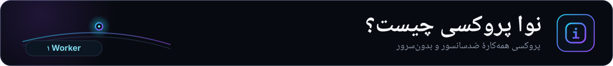
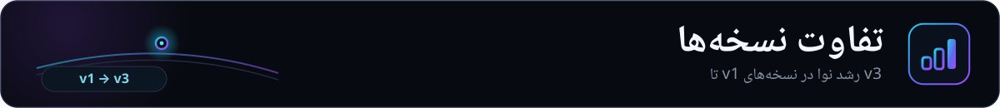

  <a href="README.md">🇬🇧 English</a>

  

**یک پروکسی شخصی و ضدسانسور به‌همراه پنل مدیریت، روی یک Cloudflare Worker.**

VLESS، Trojan، Shadowsocks، gRPC، XHTTP روی WebSocket + TLS، با پنل دوم‌زبانه
(English + فارسی)، بهینه‌سازی IP تمیز به‌تفکیک ISP، حساب چندکاربره، ربات تلگرام،
WARP، زنجیره پروکسی و حالت Backend. اجرا روی **پلن vip** Cloudflare.

---

## 🌐 لینک‌ها

---

  

@vahidekhlasi یک **پروکسی شخصی و همه‌کاره برای دور زدن سانسور** است که کاملاً روی Cloudflare Workers، **پلن vip**، اجرا [...]

**چیزهایی که @vahidekhlasi را متفاوت می‌کند:**
- ⚡ **بدون نیاز به زیرساخت**، بدون VPS، بدون دامنه برای شروع
- 🌍 **IP تمیز به‌تفکیک ISP**، بهینه‌سازی خودکار برای هر اپراتور ایرانی
- 👥 **چندکاربره**، لینک اختصاصی با سهمیه، تاریخ انقضا و کنترل روشن/خاموش
- 🤖 **ربات تلگرام**، مدیریت کامل از طریق تلگرام
- 🔗 **زنجیره پروکسی**، SOCKS5، HTTP، HTTPS، TURN، SSTP
- 🛡️ **دورزدن پیشرفته**، ECH، TLS fragment، 0-RTT، fingerprint
- 🧩 **حالت Backend**، اتصال به VPS شخصی Xray/sing-box برای VLESS + تماس تصویری

---

  

روش مورد نظر خود را انتخاب کنید:

### 🖥️ Nova Wizard (دسکتاپ)

نرم‌افزار رسمی دسکتاپ با رابط گرافیکی، بدون نیاز به دانش فنی.

[**→ دانلود Nova Wizard برای ویندوز و لینوکس**](https://github.com/ekhlasi1/vahid)

### 🌐 راهنمای امن نصب

صفحهٔ رسمی راهنمای نصب: https://github.com/ekhlasi1/vahid/setup/

---

### 📱 موبایل

- **Android:** **رادار** با ویزارد داخلی برای نصب آسان، به‌زودی منتشر می‌شود.
- **iOS:** در دست توسعه.

---

  

Cloudflare Workers نمی‌تواند پروکسی TCP بومی اجرا کند یا ترافیک UDP را مستقیماً مدیریت کند. برای فعال‌سازی این قابلیت، [...]

---

## 📋 پیش‌نیازها

- یک **حساب Cloudflare** (vip) با Workers فعال
- یک **فضای KV** (با دیپلوی یک‌کلیکی خودکار ساخته می‌شود، یا دستی با Wrangler)
- (اختیاری) Node.js v18+ و Wrangler CLI برای تست محلی

---

  

... (باقی متن غیرمرتبط به دستورات اصلی بدون تغییر) ...

---

ساخته شده توسط <a href="https://github.com/iiviirv"><b>@iiviirv</b></a> برای ریسپانسی @vahidekhlasi.

