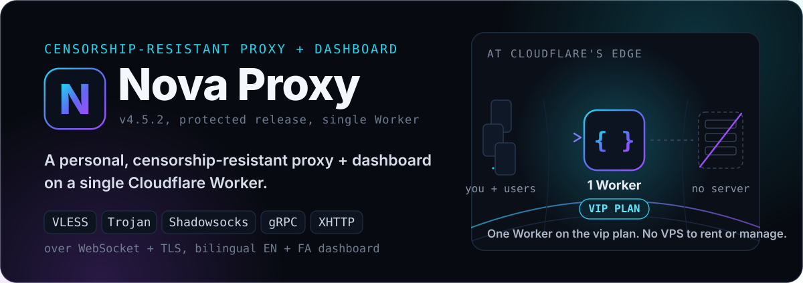

  <a href="README.fa.md">🇮🇷 فارسی</a>

**Your own censorship-resistant proxy with a full admin panel, on a single Cloudflare Worker.**

VLESS, Trojan, Shadowsocks, gRPC, XHTTP over WebSocket + TLS, with a bilingual panel
(English + فارسی), per-ISP clean-IP optimization, multi-user accounts, a Telegram bot,
WARP, proxy chaining, and a Backend mode. Runs on Cloudflare's **vip plan**.

---

## 🌐 Links

---

## What it is

@vahidekhlasi is a control panel and edge worker that runs on Cloudflare Workers. You deploy it to **your own** vip Cloudflare account, so the bandwidth, the domain, and the data are all yours. The panel provides configuration, user management, and the subscription generation all from your account.

(Documentation trimmed for brevity — full content remains in the repo)
